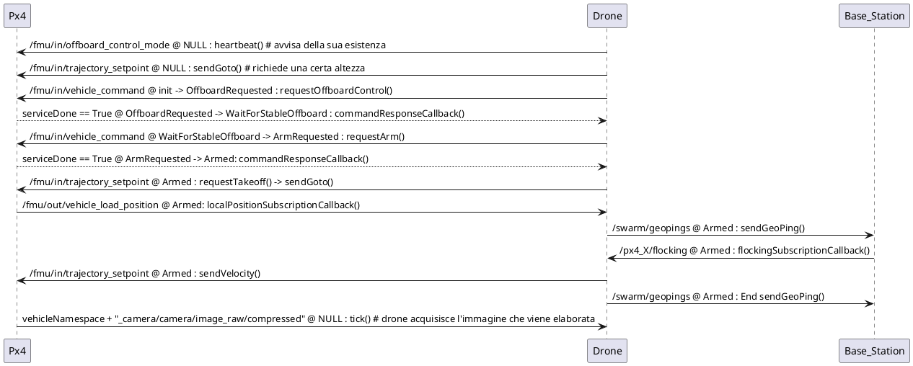
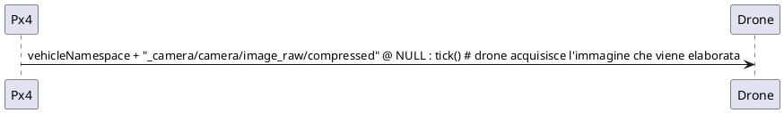

# Tutorial per l'utente e lo sviluppatore della piattaforma 4DDS

## a) Tutorial per l'utente

### Come installare WSL su Windows 11

1. Apri **PowerShell** come amministratore e digita il seguente comando per installare WSL2:

   ```
   wsl --install
   ```

2. Per ulteriori dettagli, consulta la [pagina ufficiale di WSL](https://docs.microsoft.com/windows/wsl/install).

### Come caricare i container 4DDS

1. Dopo aver installato WSL2, importa il disco virtuale 4DDS seguendo questi passaggi:

   - Estrai il file `4DDS.zip` utilizzando un programma come **7zip** per ottenere il file `4DDS.tar` (circa 19-20GB).
   - Apri **Windows PowerShell**, vai nella cartella contenente il file `4DDS.tar` e digita:
     ```
     wsl --import 4DDS . 4DDS.tar
     ```

2. Al termine dell'operazione, sarà presente un disco virtuale chiamato `ext4.vhdx` nella cartella attuale. Puoi eliminare `4DDS.tar` per risparmiare spazio, ma sarà possibile recuperarlo nuovamente da `4DDS.zip`.

### Come creare uno scenario e farlo partire

1. Apri **PowerShell** e digita il comando:

   ```
   wsl -d 4DDS
   ```

2. Accedi come utente `fourdds`:

   ```
   su fourdds
   cd
   ```

   - Password dell'utente: `4DDS1234`

3. Installa **Visual Studio Code** seguendo le istruzioni al [link ufficiale](https://code.visualstudio.com/docs/remote/wsl).

   - Usa `/home/fourdds` come workspace folder di VS Code.

### Metriche di simulazione

- **Metriche online**:

  - Contatore dei target trovati durante una missione di 10 minuti.
  - Clock di sistema (300 ms) e tick di logging (10 sec).

- **Metriche offline**:

  1. Tabella delle posizioni dei droni (timestamp, ID drone, posizione, orientamento, velocità).
  2. Tabella dei target trovati (timestamp, ID drone, posizione, orientamento, velocità).
  3. Tabella delle collisioni (timestamp, ID droni, posizioni, orientamenti, velocità).

### Script di log

- **Conversione log in CSV**: Script per convertire i log in formato CSV (per analisi in Excel).
- **Processing log**: Script per calcolare la distanza media tra i droni.

### Lanciare una simulazione di missione e ottenere i log degli eventi

1. Apri **PowerShell** e prepara **quattro tab** sulla home dell'utente `fourdds`:
   - **Tab 1**: Avvia il processo di comunicazione tra PX4 e ROS2 con il comando:

     ```
     MicroXRCEAgent udp4 -p 8888
     ```

   - **Tab 2**: Attiva la simulazione:

     ```
     cd ws
     source setup.bash
     cd ..
     ./PX4-Autopilot/Tools/simulation/gazebo-classic/sitl_multiple_run.sh -n <numero_droni> -w find_targets
     ```

     - **Note:**

      - **Per chiudere Gazebo, premere `Ctrl-C` nella scheda in cui è stato lanciato.**
      - **Se rimangono processi attivi, eseguire:**

        ```bash
        killall -9 gzclient
        killall -9 gzserver
        ```

      Si aprirà una finestra con l'ambiente di simulazione (Fig.1), dove è possibile visualizzare e interagire con droni, ostacoli e target.

      


   - **Tab 3**: Attiva la logica dei droni (flocking e obstacle avoidance):

     ```
     cd ros2_ws
     source setup.bash
     bash run.sh -n <numero_droni>
     ```

   - **Tab 4**: Registra i log e converti in CSV:

     ```
     cd ros2_ws
     source setup.bash
     bash register.bash
     ```

     - Dopo la registrazione dei log, esegui:
       ```
       ros2 run analysis ConvertToCSV log_<timestamp>/log_<timestamp>.db3
       ```
       - **Genererà i file `geopings.csv` e `target_position.csv`.**
       - **Spostarli in una cartella dedicata per analisi successive.**
### Modifica dei parametri di simulazione

Per modificare i parametri della simulazione:

- **Modificare il file `/home/fourdds/.swarm/options.yaml`.**

Se apportate modifiche ai package ROS2 (ad esempio, `obstacle_avoidance`, `target_detection`, `drone`, `base_station`), è necessario ricompilare il progetto:

```bash
cd ros2_ws
source setup.bash
colcon build --packages-select target_detection obstacle_avoidance base_station drone
```

### Consigli per il lancio di simulazioni

- Dopo aver modificato la logica di ROS2, potrebbe non essere necessario chiudere e riaprire Gazebo e il broker XRCE-DDS. Tuttavia, se i droni diventano lenti ad armarsi, conviene riavviare tutto da capo.

- Per creare scenari personalizzati (.world), apri Gazebo con il comando `gazebo` e salva il mondo nella cartella `~/PX4-Autopilot/Tools/simulation/gazebo-classic/sitl_gazebo_classic/worlds/`.

### Architettura software della simulazione

Nella nuova architettura:

- **ROS2** facilita la comunicazione tra nodi e autopiloti PX4.
- **I nodi ROS2** possono pubblicare e sottoscrivere messaggi su specifici topic.
- **Il broker XRCE-DDS** gestisce lo smistamento dei messaggi.

**Esempio di comunicazione:**

- **PX4** pubblica dati GPS su `/px4_1/fmu/out/vehicle_gps_position`.
- **Un nodo ROS2** può sottoscrivere questo topic per ricevere i dati.

---


### Diagramma di interazione del drone 


Il diagramma di interazione del drone rappresenta due cicli principali:

1. **Ciclo di Bootstrap**: Questo ciclo si ripete ogni 'options.controllerTimerMs' millisecondi e parte chiamando la funzione `bootstrap()`. Il suo scopo è gestire il controllo offboard, l'armamento e il movimento del drone.


Incolla il codice sopra [qui](https://www.plantuml.com/)

2. **Ciclo di Target Detection**: C'è un'altra iterazione del drone che si ripete ogni 750 ms. Questo ciclo parte chiamando la funzione `targetDetection()`, che avvia il processo descritto dal nuovo diagramma.

- Il modulo TargetDetection si sottoscrive al topic per ricevere le immagini.
- Quando viene pubblicata una nuova immagine, `cameraSubscriptionCallback` viene chiamato e salva l'immagine in `lastCameraData`.
- Successivamente, quando `tick()` viene chiamato, elabora l'ultima immagine disponibile (`lastCameraData`) per verificare se ci sono obiettivi rilevati.


Incolla il codice sopra [qui](https://www.plantuml.com/)

## b) Tutorial per lo sviluppatore

### Componenti principali dell'ambiente 4DDS

1. **PX4**: Autopilota dei droni. Modificato per aggiungere sensori mancanti e accettare setpoint di velocità in coordinate NED.

2. **ROS2**: Middleware per il controllo offboard e la logica di alto livello del drone.

   - Package principali:
     - `drone`: logica di un singolo drone.
     - `base_station`: coordina il flocking.
     - `obstacle_avoidance`: gestione degli ostacoli.
     - `target_detection`: rilevamento dei target tramite Hough Transform.
     - `parameters`: lettura parametri da file YAML.
     - `fdds_messages`: definizioni dei messaggi GeoPing e Flocking.
     - `analysis`: analisi dei log tramite `PathView.py`.

3. **Gazebo Classic**: Versione vecchia di Gazebo, integrata con PX4 per le simulazioni multi-drone e marine.

   - Modifiche per gestire il LIDAR e la telecamera dinamicamente, utilizzando più sensori dello stesso tipo.

### Modifiche a PX4

- **Quadricottero Iris**: Aggiunto LIDAR orizzontale e camera rivolta verso il basso.
- **Rover**: Riscalato.
- **BlueROV2**: Aggiunto sensore IMU e template per spawn multi-drone.
- **Moduli di controllo**: Modifiche per accettare setpoint di velocità in coordinate NED.

**Importante**: Non utilizzare `make distclean` in PX4-Autopilot, altrimenti tutte le modifiche andranno perse.

### Modifiche a ROS2

**Struttura dei package:**

- **drone:** Logica del singolo drone (armamento, decollo, flocking).
- **base_station:** Coordina lo sciame e gestisce il flocking.
- **obstacle_avoidance:** Gestisce l'evitamento degli ostacoli.
- **target_detection:** Rileva i target utilizzando tecniche come la trasformata di Hough.
- **parameters:** Gestisce i parametri di simulazione da un file YAML.
- **fdds_messages:** Definisce i messaggi utilizzati per la comunicazione.
- **analysis:** Contiene strumenti per l'analisi dei dati (es. `PathView.py`).

**Compilazione dopo le modifiche:**

- **Ricompilare i package modificati:**

  ```bash
  cd ros2_ws
  source setup.bash
  colcon build --packages-select <package_modificato>
  ```

### Modifiche a Gazebo

**Script di lancio:**

- **`sitl_multiple_run.sh`:** Modificato per lo spawn casuale dei droni.

**Plugin per sensori:**

- **Modifiche ai plugin LIDAR e camera per supportare più sensori sullo stesso veicolo.**
- **I plugin si trovano in `/home/fourdds/ws/gazebo_plugins/src`.**

**Per aggiungere nuovi sensori:**

1. **Individuare il plugin necessario.**
2. **Apportare le modifiche per gestire più istanze del sensore.**
3. **Ricompilare i plugin:**

   ```bash
   cd ws
   colcon build --symlink-install
   source setup.bash
   ```

### Problemi comuni

- **Se i sensori non vengono caricati correttamente:**

  - **Verificare il sourcing corretto (`source setup.bash`).**
  - **Controllare il codice dei plugin per errori.**

---

## References

- [GitHub: Matteo Del Seppia](https://gist.github.com/matteodelseppia/c0dba9c471e36e07c8bb8f2834fa2b93)
- [PX4 Autopilot](https://github.com/PX4/PX4-Autopilot)
- [PX4 e ROS2](https://docs.px4.io/main/en/ros/ros2)
- [ROS2 Communication](https://docs.px4.io/main/en/ros/ros2_comm.html)
- [Gazebo Simulation](https://docs.px4.io/v1.12/en/simulation/gazebo.html)
- [ROS2 Tutorial](https://docs.ros.org/en/humble/Tutorials/Beginner-Client-Libraries/Writing-A-Simple-Cpp-Publisher-And-Subscriber.html)
