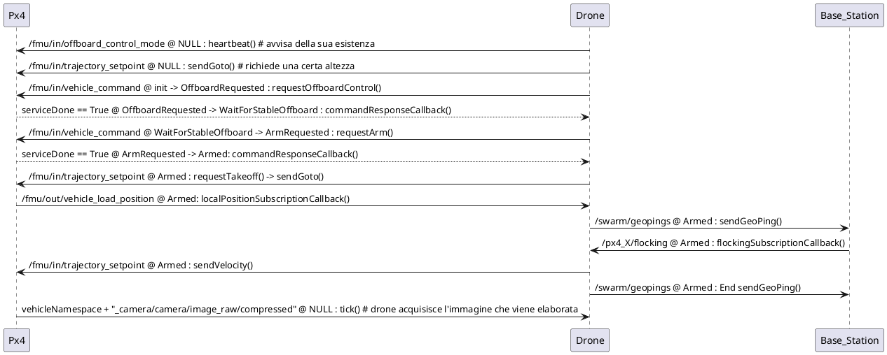
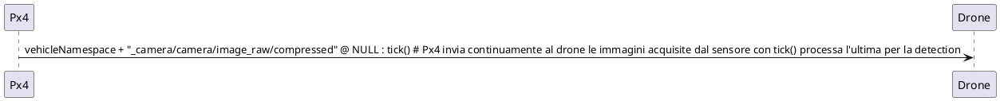

# Tutorial per l'utente e lo sviluppatore della piattaforma 4DDS

## a) Tutorial per l'utente

### Come installare WSL su Windows 11

1. Apri **PowerShell** come amministratore e digita il seguente comando per installare WSL2:

   ```
   wsl --install
   ```

2. Per ulteriori dettagli, consulta la [pagina ufficiale di WSL](https://docs.microsoft.com/windows/wsl/install).

### Come caricare i container 4DDS

1. Dopo aver installato WSL2, importa il disco virtuale 4DDS seguendo questi passaggi:

   - Estrai il file `4DDS.zip` utilizzando un programma come **7zip** per ottenere il file `4DDS.tar` (circa 19-20GB).
   - Apri **Windows PowerShell**, vai nella cartella contenente il file `4DDS.tar` e digita:
     ```
     wsl --import 4DDS . 4DDS.tar
     ```

2. Al termine dell'operazione, sarà presente un disco virtuale chiamato `ext4.vhdx` nella cartella attuale. Puoi eliminare `4DDS.tar` per risparmiare spazio, ma sarà possibile recuperarlo nuovamente da `4DDS.zip`.

### Come creare uno scenario e farlo partire

1. Apri **PowerShell** e digita il comando:

   ```
   wsl -d 4DDS
   ```

2. Accedi come utente `fourdds`:

   ```
   su fourdds
   cd
   ```

   - Password dell'utente: `4DDS1234`

3. Installa **Visual Studio Code** seguendo le istruzioni al [link ufficiale](https://code.visualstudio.com/docs/remote/wsl).

   - Usa `/home/fourdds` come workspace folder di VS Code.

### Metriche di simulazione

- **Metriche online**:

  - Contatore dei target trovati durante una missione di 10 minuti.
  - Clock di sistema (300 ms) e tick di logging (10 sec).

- **Metriche offline**:

  1. Tabella delle posizioni dei droni (timestamp, ID drone, posizione, orientamento, velocità).
  2. Tabella dei target trovati (timestamp, ID drone, posizione, orientamento, velocità).
  3. Tabella delle collisioni (timestamp, ID droni, posizioni, orientamenti, velocità).

### Script di log

- **Conversione log in CSV**: Script per convertire i log in formato CSV (per analisi in Excel).
- **Processing log**: Script per calcolare la distanza media tra i droni.

### Lanciare una simulazione di missione e ottenere i log degli eventi

1. Apri **PowerShell** e prepara **quattro tab** sulla home dell'utente `fourdds`:
   - **Tab 1**: Avvia il processo di comunicazione tra PX4 e ROS2 con il comando:

     ```
     MicroXRCEAgent udp4 -p 8888
     ```

   - **Tab 2**: Attiva la simulazione:

     ```
     cd ws
     source setup.bash
     cd ..
     ./PX4-Autopilot/Tools/simulation/gazebo-classic/sitl_multiple_run.sh -n <numero_droni> -w find_targets
     ```

     - **Note:**

      - **Per chiudere Gazebo, premere `Ctrl-C` nella scheda in cui è stato lanciato.**
      - **Se rimangono processi attivi, eseguire:**

        ```bash
        killall -9 gzclient
        killall -9 gzserver
        ```

      Si aprirà una finestra con l'ambiente di simulazione (Fig.1), dove è possibile visualizzare e interagire con droni, ostacoli e target.

      


   - **Tab 3**: Attiva la logica dei droni (flocking e obstacle avoidance):

     ```
     cd ros2_ws
     source setup.bash
     bash run.sh -n <numero_droni>
     ```

   - **Tab 4**: Registra i log e converti in CSV:

     ```
     cd ros2_ws
     source setup.bash
     bash register.bash
     ```

     - Dopo la registrazione dei log, esegui:
       ```
       ros2 run analysis ConvertToCSV log_<timestamp>/log_<timestamp>.db3
       ```
       - **Genererà i file `geopings.csv` e `target_position.csv`.**
       - **Spostarli in una cartella dedicata per analisi successive.**
### Modifica dei parametri di simulazione

Per modificare i parametri della simulazione:

- **Modificare il file `/home/fourdds/.swarm/options.yaml`.**

Se apportate modifiche ai package ROS2 (ad esempio, `obstacle_avoidance`, `target_detection`, `drone`, `base_station`), è necessario ricompilare il progetto:

```bash
cd ros2_ws
source setup.bash
colcon build --packages-select target_detection obstacle_avoidance base_station drone
```

### Consigli per il lancio di simulazioni

- Dopo aver modificato la logica di ROS2, potrebbe non essere necessario chiudere e riaprire Gazebo e il broker XRCE-DDS. Tuttavia, se i droni diventano lenti ad armarsi, conviene riavviare tutto da capo.

- Per creare scenari personalizzati (.world), apri Gazebo con il comando `gazebo` e salva il mondo nella cartella `~/PX4-Autopilot/Tools/simulation/gazebo-classic/sitl_gazebo_classic/worlds/`.

### Architettura software della simulazione

Nella nuova architettura:

- **ROS2** facilita la comunicazione tra nodi e autopiloti PX4.
- **I nodi ROS2** possono pubblicare e sottoscrivere messaggi su specifici topic.
- **Il broker XRCE-DDS** gestisce lo smistamento dei messaggi.

**Esempio di comunicazione:**

- **PX4** pubblica dati GPS su `/px4_1/fmu/out/vehicle_gps_position`.
- **Un nodo ROS2** può sottoscrivere questo topic per ricevere i dati.

---


### Diagramma di interazione del drone 

Il diagramma di interazione del drone rappresenta due cicli principali:

**legenda:**
```
-topic @ stato attuale : funziona da dove parte la ricezione o l'invio del topic
-topic @ stato attuale -> stato successibo : funziona da dove parte la ricezione o l'invio del topic
```

1. **Ciclo di Bootstrap**: Questo ciclo si ripete ogni 'options.controllerTimerMs' millisecondi e parte chiamando la funzione `bootstrap()`. Il suo scopo è gestire il controllo offboard, l'armamento e il movimento del drone.



Incolla il codice sopra [qui](https://www.plantuml.com/).

2. **Ciclo di Target Detection**: C'è un'altra iterazione del drone che si ripete ogni 750 ms. Questo ciclo parte chiamando la funzione `targetDetection()`, che avvia il processo descritto dal nuovo diagramma.

- Il modulo TargetDetection si sottoscrive al topic per ricevere le immagini.
- Quando viene pubblicata una nuova immagine, `cameraSubscriptionCallback` viene chiamato e salva l'immagine in `lastCameraData`.
- Successivamente, quando `tick()` viene chiamato, elabora l'ultima immagine disponibile (`lastCameraData`) per verificare se ci sono obiettivi rilevati.


Incolla il codice sopra [qui](https://www.plantuml.com/)

## b) Tutorial per lo sviluppatore

### Componenti principali dell'ambiente 4DDS

1. **PX4**: Autopilota dei droni. Modificato per aggiungere sensori mancanti e accettare setpoint di velocità in coordinate NED.

2. **ROS2**: Middleware per il controllo offboard e la logica di alto livello del drone.

   - Package principali:
     - `drone`: logica di un singolo drone.
     - `base_station`: coordina il flocking.
     - `obstacle_avoidance`: gestione degli ostacoli.
     - `target_detection`: rilevamento dei target tramite Hough Transform.
     - `parameters`: lettura parametri da file YAML.
     - `fdds_messages`: definizioni dei messaggi GeoPing e Flocking.
     - `analysis`: analisi dei log tramite `PathView.py`.

3. **Gazebo Classic**: Versione vecchia di Gazebo, integrata con PX4 per le simulazioni multi-drone e marine.

   - Modifiche per gestire il LIDAR e la telecamera dinamicamente, utilizzando più sensori dello stesso tipo.

### PX4

#### Droni

##### **Quadricottero Iris**
- **Percorso file**: `/home/fourdds/PX4-Autopilot/Tools/simulation/gazebo-classic/sitl-gazebo_classic/models/iris/iris.sdf.jinja`

###### **Sensori**
1. **IMU (Inertial Measurement Unit)**: 
   - Misura l'accelerazione e la rotazione del drone.
   - Configurato tramite il plugin `libgazebo_imu_plugin.so`.

2. **LiDAR**: 
   - Scanner laser per la mappatura e rilevamento ostacoli.
   - Definito tramite il modello `4dds_rplidar`.

3. **Fotocamera FPV (First-Person View)**: 
   - Utilizzata per la visione in prima persona.
   - Definita tramite il modello `fpv_cam`.

4. **GPS**: 
   - Utilizzato per ottenere la posizione locale del drone.
   - Definito tramite il modello GPS incluso.

5. **Magnetometro**: 
   - Misura il campo magnetico per determinare l'orientamento rispetto al campo magnetico terrestre.
   - Configurato tramite il plugin `libgazebo_magnetometer_plugin.so`.

6. **Barometro**: 
   - Misura la pressione atmosferica per stimare l'altitudine.
   - Configurato tramite il plugin `libgazebo_barometer_plugin.so`.

###### **Attuatori**
1. **Rotor_0**: 
   - Uno dei quattro rotori principali per il volo.
   - Controllato tramite giunto `revolute` e il plugin `libgazebo_motor_model.so`.

2. **Rotor_1**: 
   - Simile a Rotor_0, controllato da un giunto `revolute` e plugin.

3. **Rotor_2**: 
   - Simile a Rotor_0, ma con direzione di rotazione opposta (CW).

4. **Rotor_3**: 
   - Simile a Rotor_2, controllato da giunto e plugin.

Ogni rotore ha un controllo di velocità e direzione tramite i relativi plugin.

---

##### **Rover**
- **Percorso file**: `/home/fourdds/PX4-Autopilot/Tools/simulation/gazebo-classic/sitl-gazebo_classic/models/rover/rover.sdf.jinja`

###### **Sensori**
1. **IMU (Inertial Measurement Unit)**: 
   - Misura l'accelerazione e la rotazione del rover.
   - Configurato tramite il plugin `libgazebo_imu_plugin.so`.

2. **LiDAR**: 
   - Scanner laser per la mappatura e rilevamento ostacoli.
   - Definito tramite il modello `4dds_rplidar`.

3. **GPS**: 
   - Utilizzato per ottenere la posizione locale del rover.
   - Definito tramite il modello GPS incluso.

4. **Magnetometro**: 
   - Misura il campo magnetico per determinare l'orientamento rispetto al campo magnetico terrestre.
   - Configurato tramite il plugin `libgazebo_magnetometer_plugin.so`.

5. **Barometro**: 
   - Misura la pressione atmosferica per stimare l'altitudine.
   - Configurato tramite il plugin `libgazebo_barometer_plugin.so`.

###### **Attuatori**
1. **Ruota anteriore sinistra**: 
   - Controllata tramite giunto `revolute`, definita come `front_left_wheel_joint`.
   - Controllo di posizione tramite `front_left_steering_joint`.

2. **Ruota anteriore destra**: 
   - Controllata tramite giunto `revolute`, definita come `front_right_wheel_joint`.
   - Controllo di posizione tramite `front_right_steering_joint`.

3. **Ruota posteriore sinistra**: 
   - Controllata tramite giunto `revolute`, definita come `rear_left_wheel_joint`.
   - Controllo di velocità tramite `rear_left_wheel_drive`.

4. **Ruota posteriore destra**: 
   - Controllata tramite giunto `revolute`, definita come `rear_right_wheel_joint`.
   - Controllo di velocità tramite `rear_right_wheel_drive`.

Ogni ruota è controllata tramite giunti con parametri specifici per il movimento e la direzione del rover.

---

##### **BlueROV2**
- **Percorso file**: `/home/fourdds/PX4-Autopilot/Tools/simulation/gazebo-classic/sitl_gazebo-classic/models/uuv_bluerov2_heavy/uuv_bluerov2_heavy.sdf.jinja`

###### **Sensori**
1. **IMU (Inertial Measurement Unit)**: 
   - Misura l'accelerazione e la rotazione del drone.
   - Configurato tramite il plugin `gazebo_imu_plugin`.

2. **GPS**: 
   - Utilizzato per ottenere la posizione locale.
   - Definito tramite l'inclusione del modello GPS.

3. **Magnetometro**: 
   - Misura il campo magnetico per determinare l'orientamento rispetto al campo magnetico terrestre.
   - Configurato tramite il plugin `magnetometer_plugin`.

4. **Barometro**: 
   - Misura la pressione atmosferica per stimare l'altitudine.
   - Configurato tramite il plugin `barometer_plugin`.

###### **Attuatori**
1. **Thruster1**: 
   - Propulsore per generare movimento.
   - Controllato tramite giunto `revolute` e il plugin `libgazebo_motor_model.so`.

2. **Thruster2**: 
   - Stesso setup di Thruster1 con controllo del movimento.

3. **Thruster3**: 
   - Simile agli altri thruster, controllato da un giunto `revolute` e plugin.

4. **Thruster4**: 
   - Anche questo è un propulsore controllato da giunto e plugin.

5. **Thruster5**: 
   - Propulsore con giunto `revolute` e plugin di controllo motore.

6. **Thruster6**: 
   - Stesso setup con giunto e controllo del motore.

7. **Thruster7**: 
   - Controllato da un giunto `revolute` e plugin per il controllo della velocità.

8. **Thruster8**: 
   - Ultimo thruster con configurazione simile agli altri, controllato da giunto e plugin.


- **Moduli di controllo**: Modifiche per accettare setpoint di velocità in coordinate NED.

**Importante**: Non utilizzare `make distclean` in PX4-Autopilot, altrimenti tutte le modifiche andranno perse.


#### Modifiche ai moduli di controllo per Rover e BlueROV2

##### **Rover**
- **Percorso file**: `/home/fourdds/PX4-Autopilot/src/modules/rover_pos_control/RoverPositionControl.cpp`

Il modulo di controllo per il rover è stato modificato per accettare setpoint di velocità in coordinate NED (North-East-Down), mentre in precedenza accettava solo coordinate relative al corpo del veicolo. Questo miglioramento consente un controllo più preciso e intuitivo rispetto al movimento globale del rover.

- **Funzione coinvolta**: `control_velocity`  
  Questa funzione è stata aggiornata per gestire i setpoint di velocità NED, migliorando la capacità del rover di muoversi nello spazio in base a coordinate geografiche piuttosto che in base al suo sistema di riferimento locale.

##### **BlueROV2**
- **Percorso file controllo dell'attitudine (roll, pitch, yaw)**: `/home/fourdds/PX4-Autopilot/src/modules/uuv_att_control/uuv_att_control.cpp`
- **Percorso file controllo della velocità e profondità**: `/home/fourdds/PX4-Autopilot/src/modules/uuv_pos_control/uuv_pos_control.cpp`

Il modulo di controllo della velocità e della profondità per il BlueROV2 è stato completamente riscritto. Questo aggiornamento garantisce una maggiore precisione nel controllo del movimento del veicolo subacqueo in termini di velocità e profondità.

- **Controllo dell'attitudine**: Il controllo di roll, pitch e yaw avviene nel file `uuv_att_control.cpp`, garantendo una gestione ottimale della stabilità e dell'orientamento del veicolo mentre opera sott'acqua.

- **Controllo della velocità e della profondità**:  
  La gestione della velocità e della profondità è implementata nel file `uuv_pos_control.cpp`. Questa riscrittura del modulo permette al BlueROV2 di muoversi con precisione lungo la coordinata Z, dove le coordinate NED (North-East-Down) restano il riferimento. Nella configurazione NED, le coordinate Z positive corrispondono a una maggiore profondità rispetto alla posizione di spawn del veicolo.

  Questa impostazione risulta cruciale per le missioni subacquee, dove è fondamentale mantenere un controllo accurato della profondità e della velocità lungo l'asse verticale.

---

Queste modifiche complessive ai moduli di controllo migliorano la capacità del rover di operare in ambienti terrestri e del BlueROV2 di operare in ambienti subacquei, consentendo movimenti più fluidi e precisi attraverso l'uso delle coordinate NED come riferimento.

### ROS2

ROS2 si occupa della logica di un singolo drone e di altri agenti autonomi, come la base station, rendendo il codice il più modulare possibile. I package ROS2 presenti in `/home/fourdds/ros2_ws/src` che contengono logiche già pronte sono i seguenti:

**Struttura dei package:**

- **drone:** Logica del singolo drone (armamento, decollo, flocking).
- **base_station:** Coordina lo sciame e gestisce il flocking.
- **obstacle_avoidance:** Gestisce l'evitamento degli ostacoli.
- **target_detection:** Rileva i target utilizzando tecniche come la trasformata di Hough.
- **parameters:** Gestisce i parametri di simulazione da un file YAML.
- **fdds_messages:** Definisce i messaggi utilizzati per la comunicazione.
- **analysis:** Contiene strumenti per l'analisi dei dati (es. `PathView.py`).


#### **drone**
- All’interno del package `drone` si trova la logica di un singolo drone (classe **Drone**). 
- Attualmente si occupa delle seguenti operazioni:
  - Ingresso in modalità offboard
  - Armamento del drone
  - Decollo (**takeoff**)
  - Flocking

#### **base_station**
- Contiene la logica della **BaseStation**, che coordina il flocking mandando i vettori di coesione, separazione e allineamento ai droni.
- I droni comunicano la loro posizione attraverso messaggi **GeoPing**.
- La classe **BaseStation** è un nodo ROS2 indipendente e deve essere lanciata autonomamente come i nodi dei droni.

#### **obstacle_avoidance**
- Contiene una classe utilizzata da ogni istanza della classe **Drone**.
- La classe **Drone** invoca il metodo `tick()` quando controlla la presenza di ostacoli.
- Il modulo di avoidance restituisce un vettore da seguire per evitare eventuali ostacoli.

#### **target_detection**
- Contiene la logica per la **detection dei target**.
- Attualmente utilizza la **Hough Transform** per rilevare sfere rosse individuate dalla telecamera.
- Il modulo ritorna il numero di target trovati alla posizione attuale e viene invocato tramite il metodo `tick()`, consentendo alla classe **Drone** di decidere quando rilevare i target.

#### **parameters**
- Contiene la classe **Parameters**, caricata all'avvio di un nodo **Drone** o **BaseStation**.
- I parametri vengono letti da un file YAML situato in `/home/fourdds/.swarm/options.yaml`.
- I parametri riguardano vari aspetti della simulazione, come:
  - Velocità massima dei droni
  - Raggio massimo per l'obstacle avoidance

#### **fdds_messages**
- Questo package non contiene codice, ma solo le definizioni dei messaggi **GeoPing** e **Flocking**, utilizzati dai droni e dalla base station per il coordinamento durante il flocking.
- Le definizioni dei messaggi si trovano nella cartella `msg`.

#### **analysis**
- In questo package si trova lo scheletro di un programma Python (**PathView.py**) utile per fare il parsing dei file **sqlite3** generati con **ros2 bag**.
- **ros2 bag** registra i dati di determinati topic durante la simulazione, consentendo post-processing successivo.
- Attualmente, **PathView.py** mostra le traiettorie di 5 droni durante una simulazione di flocking, evidenziando con delle X le posizioni GPS in cui i droni rilevano dei target.

**Compilazione dopo le modifiche:**

- **Ricompilare i package modificati:**

  ```bash
  cd ros2_ws
  source setup.bash
  colcon build --packages-select <package_modificato>
  ```

### Gazebo

Le modifiche apportate a Gazebo riguardano principalmente il lancio delle simulazioni e la gestione dinamica dei sensori sui veicoli. Le principali modifiche includono:

#### **Modifica dello script di lancio**
- Il file modificato si trova in: `/home/fourdds/PX4-Autopilot/Tools/simulation/gazebo-classic/sitl_multiple_run.sh`.
- È stato aggiunto il **random spawn** dei droni in posizioni casuali attorno all'origine della simulazione.

#### **Modifica del plugin per LIDAR e telecamera**
- Le modifiche sono state fatte per gestire dinamicamente il **spawn di veicoli** con uno o più sensori dello stesso tipo, pubblicando su topic differenti per distinguere semanticamente i sensori nella logica ROS2 dei droni.
- I file modificati si trovano in: `/home/fourdds/ws/gazebo_plugins/src` e fanno parte dei **gazebo-ros-pkgs**.

#### **Modifica al plugin del LIDAR**
- Le modifiche al plugin del LIDAR riguardano l'aggiunta della gestione di più LIDAR per veicolo, ciascuno pubblicato su un topic differente.
- È stato modificato il file: `/home/fourdds/ws/gazebo_plugins/src/gazebo_ros_ray_sensor.cpp`.
  - Nella funzione `::Load()` è stato inserito un controllo per la presenza del tag `<px4/>` nella specifica SDF del sensore LIDAR.
  - Questo permette al plugin di riconoscere la fine dei sensori LIDAR per un veicolo e di incrementare una variabile ID per distinguere i topic di ogni LIDAR.
  - Ad esempio:
    - Il **primo LIDAR** potrebbe essere utilizzato per l'obstacle avoidance e pubblicare su un topic `px4_X/rplidar`.
    - Il **secondo LIDAR** potrebbe puntare verso il basso e pubblicare su un topic `px4_X/downlidar`.

#### **Estensione a nuovi sensori**
- Se si decide di aggiungere nuovi sensori, è necessario individuare i plugin appropriati per simularli e apportare le stesse modifiche fatte al plugin del LIDAR per gestirli.

#### **Compilazione delle modifiche**
- Dopo aver apportato modifiche ai plugin di Gazebo nella directory `/home/fourdds/ws`, è necessario ricompilare il codice con:
  ```bash
  colcon build --symlink-install
  ```
- Successivamente, fare il sourcing con:
  ```bash
  source setup.bash
  ```

#### **Risoluzione dei problemi di spawn**
- Se ci sono problemi con il caricamento dei sensori durante lo spawn della simulazione (indicati da errori rossi nell'output), molto probabilmente:
  1. Non è stato fatto correttamente il sourcing dei **gazebo-ros-pkgs**.
  2. C'è un errore nel codice introdotto per gestire lo **spawn dinamico dei sensori**.


### Problemi comuni

- **Se i sensori non vengono caricati correttamente:**

  - **Verificare il sourcing corretto (`source setup.bash`).**
  - **Controllare il codice dei plugin per errori.**

---

## References

- [GitHub: Matteo Del Seppia](https://gist.github.com/matteodelseppia/c0dba9c471e36e07c8bb8f2834fa2b93)
- [PX4 Autopilot](https://github.com/PX4/PX4-Autopilot)
- [PX4 e ROS2](https://docs.px4.io/main/en/ros/ros2)
- [ROS2 Communication](https://docs.px4.io/main/en/ros/ros2_comm.html)
- [Gazebo Simulation](https://docs.px4.io/v1.12/en/simulation/gazebo.html)
- [ROS2 Tutorial](https://docs.ros.org/en/humble/Tutorials/Beginner-Client-Libraries/Writing-A-Simple-Cpp-Publisher-And-Subscriber.html)
