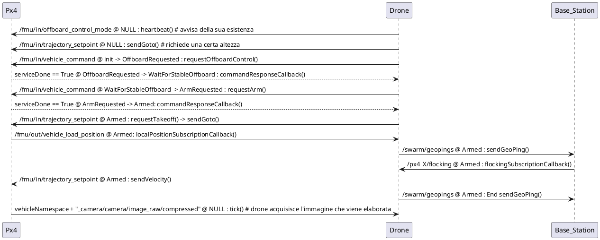
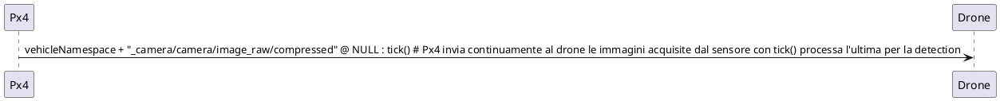

### Diagramma di interazione del drone 
path = `/home/fourdds/ros2_ws/src/drone/src/Drone.cpp`

Il diagramma di interazione del drone rappresenta due cicli principali:

**legenda:**
```
-topic @ stato attuale : funziona da dove parte la ricezione o l'invio del topic
-topic @ stato attuale -> stato successibo : funziona da dove parte la ricezione o l'invio del topic
```

1. **Ciclo di Bootstrap**: Questo ciclo si ripete ogni 'options.controllerTimerMs' millisecondi e parte chiamando la funzione `bootstrap()`. Il suo scopo è gestire il controllo offboard, l'armamento e il movimento del drone.



Incolla il codice sopra [qui](https://www.plantuml.com/).

2. **Ciclo di Target Detection**: C'è un'altra iterazione del drone che si ripete ogni 750 ms. Questo ciclo parte chiamando la funzione `targetDetection()`, che avvia il processo descritto dal nuovo diagramma.

- Il modulo TargetDetection si sottoscrive al topic per ricevere le immagini.
- Quando viene pubblicata una nuova immagine, `cameraSubscriptionCallback` viene chiamato e salva l'immagine in `lastCameraData`.
- Successivamente, quando `tick()` viene chiamato, elabora l'ultima immagine disponibile (`lastCameraData`) per verificare se ci sono obiettivi rilevati.


Incolla il codice sopra [qui](https://www.plantuml.com/)
