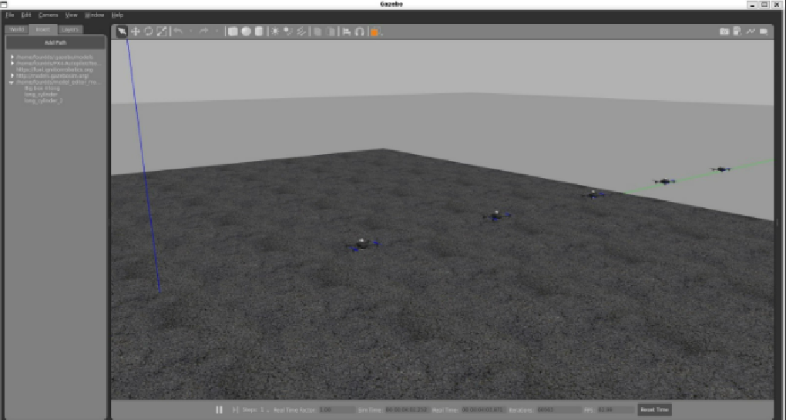

### Metriche di simulazione

- **Metriche online**:

  - Contatore dei target trovati durante una missione di 10 minuti.
  - Clock di sistema (300 ms) e tick di logging (10 sec).

- **Metriche offline**:

  1. Tabella delle posizioni dei droni (timestamp, ID drone, posizione, orientamento, velocità).
  2. Tabella dei target trovati (timestamp, ID drone, posizione, orientamento, velocità).
  3. Tabella delle collisioni (timestamp, ID droni, posizioni, orientamenti, velocità).

### Script di log

- **Conversione log in CSV**: Script per convertire i log in formato CSV (per analisi in Excel).
- **Processing log**: Script per calcolare la distanza media tra i droni.

### Lanciare una simulazione di missione e ottenere i log degli eventi

1. Apri **PowerShell** e prepara **quattro tab** sulla home dell'utente `fourdds`:
   - **Tab 1**: Avvia il processo di comunicazione tra PX4 e ROS2 con il comando:

     ```
     MicroXRCEAgent udp4 -p 8888
     ```

   - **Tab 2**: Attiva la simulazione:

     ```
     cd ws
     source setup.bash
     cd ..
     ./PX4-Autopilot/Tools/simulation/gazebo-classic/sitl_multiple_run.sh -n <numero_droni> -w find_targets
     ```

     - **Note:**

      - **Per chiudere Gazebo, premere `Ctrl-C` nella scheda in cui è stato lanciato.**
      - **Se rimangono processi attivi, eseguire:**

        ```bash
        killall -9 gzclient
        killall -9 gzserver
        ```

      Si aprirà una finestra con l'ambiente di simulazione (Fig.1), dove è possibile visualizzare e interagire con droni, ostacoli e target.

      


   - **Tab 3**: Attiva la logica dei droni (flocking e obstacle avoidance):

     ```
     cd ros2_ws
     source setup.bash
     bash run.sh -n <numero_droni>
     ```

   - **Tab 4**: Registra i log e converti in CSV:

     ```
     cd ros2_ws
     source setup.bash
     bash register.bash
     ```

     - Dopo la registrazione dei log, esegui:
       ```
       ros2 run analysis ConvertToCSV log_<timestamp>/log_<timestamp>.db3
       ```
       - **Genererà i file `geopings.csv` e `target_position.csv`.**
       - **Spostarli in una cartella dedicata per analisi successive.**
### Modifica dei parametri di simulazione

Per modificare i parametri della simulazione:

- **Modificare il file `/home/fourdds/.swarm/options.yaml`.**

Se apportate modifiche ai package ROS2 (ad esempio, `obstacle_avoidance`, `target_detection`, `drone`, `base_station`), è necessario ricompilare il progetto:

```bash
cd ros2_ws
source setup.bash
colcon build --packages-select target_detection obstacle_avoidance base_station drone
```

### Consigli per il lancio di simulazioni

- Dopo aver modificato la logica di ROS2, potrebbe non essere necessario chiudere e riaprire Gazebo e il broker XRCE-DDS. Tuttavia, se i droni diventano lenti ad armarsi, conviene riavviare tutto da capo.

- Per creare scenari personalizzati (.world), apri Gazebo con il comando `gazebo` e salva il mondo nella cartella `~/PX4-Autopilot/Tools/simulation/gazebo-classic/sitl_gazebo_classic/worlds/`.

### Architettura software della simulazione

Nella nuova architettura:

- **ROS2** facilita la comunicazione tra nodi e autopiloti PX4.
- **I nodi ROS2** possono pubblicare e sottoscrivere messaggi su specifici topic.
- **Il broker XRCE-DDS** gestisce lo smistamento dei messaggi.

**Esempio di comunicazione:**

- **PX4** pubblica dati GPS su `/px4_1/fmu/out/vehicle_gps_position`.
- **Un nodo ROS2** può sottoscrivere questo topic per ricevere i dati.

---
